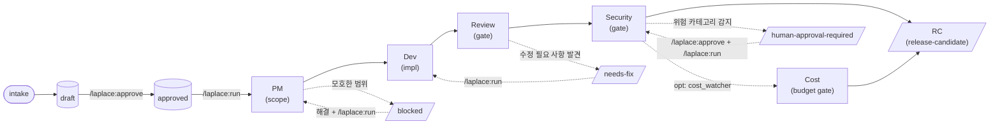

# Laplace

**언어:** [English](README.md) | 한국어

Laplace는 **로컬 AI 엔지니어링 루프(Local AI Engineering Loop)를 실행 및 제어**하는 Claude Code 플러그인입니다. 에이전트의 자체적인 지능이나 편의성에 의존하기보다, 코드 수준에서 정의된 **엄격한 절차(Procedure)의 준수**를 보장하는 것을 목표로 합니다. 

작업을 쪼개기(Decomposition) 전에 먼저 컨텍스트(Context)를 분석하고, 개발을 실행하기 전에 로컬 이슈의 현재 상태를 검증하며, 코드 리뷰가 진행되기 전에 코드 변경 범위를 제한합니다. 또한 작업을 마쳤다고 선언하기 전에 철저한 검증을 통과해야 하며, 릴리스 후보(Release Candidate, RC)로 승격시키기 전에 필수 검토 단계를 거치도록 합니다. 특히 되돌릴 수 없거나 외부 시스템에 영향을 미치는 위험한 행위(예: 외부 라이브러리 추가, 릴리스 배포 등)는 반드시 사용자의 승인을 거쳐야만 수행됩니다.

---

## 개발 배경: 왜 Laplace가 필요한가?

아무런 제약 없이 작동하는 AI 코딩 에이전트들은 코드 차이(diff)만으로는 파악하기 힘든 소프트웨어 엔지니어링의 정석적인 절차를 누락하곤 합니다. 전체 맥락 파악, 명확한 작업 범위 정의, 테스트 실행 결과(Evidence) 기록, 리뷰를 위한 일시 대기, 그리고 파괴적이거나 돌이킬 수 없는 명령을 내리기 전에 사람의 의사를 묻는 일 등이 대표적입니다. 

현대 AI 모델 자체는 대부분 코드를 작성할 만큼 충분히 똑똑합니다. 문제는 **이를 통제할 규율과 절차의 부재**입니다. 절차가 생략되면 겉보기엔 그럴듯하게 동작하지만 실제로는 결함이 포함된 결과물이 생성되기 쉽습니다. 감지하기 어려운 잠재적 기능 결함(Regression)이 코드베이스에 유입되거나, 작업 범위가 불필요하게 팽창하며, 소스 코드에 API 키 등 보안 자격 증명이 노출되고, 보호된 브랜치에 강제 푸시(Force Push)가 일어납니다. 더 심각한 경우, 검증되지 않은 작업이 에이전트에 의해 임의로 "완료"로 판정되기도 합니다.

Laplace는 에이전트가 알아서 정석대로 일하기를 바라는 프롬프트 최적화 대신, 개발 프로세스 자체를 **결정론적(Deterministic)**으로 제어합니다.

- **실행 주체의 분리**: 에이전트는 하네스에 **지시**만 내릴 뿐이며, 실제 상태 전이 및 파일 조작은 Python 스크립트가 완전히 통제하고 **실행**합니다.
- **영구적인 상태 관리**: 실행 상태는 모델의 단기 메모리(컨텍스트 윈도우)가 아니라 로컬 디렉토리인 `.harness/`에 파일로 기록되어 저장됩니다. 따라서 컨텍스트가 압축(Compaction)되거나 에이전트가 재시작되어도 감사 히스토리가 안전하게 보존됩니다.
- **철저한 사람 승인 게이트**: 보안 자격 증명, 운영(Production) 시스템 접근, 의존성 설치, 외부 네트워크 통신, 배포 릴리스 등 민감한 카테고리는 **반드시** 사용자의 수동 승인을 거쳐야 진행됩니다. 에이전트가 이 정책을 임의로 해제하거나 약화할 수 없습니다.
- **증거 기반의 동작**: 모든 개발 프로세스 단계는 테스트 출력, 변경점(diff), 판단 사유를 실행 로그에 증거(Evidence)로 남겨야만 합니다. 이 내역은 report 스킬을 통해 보고서로 보기 좋게 렌더링됩니다.

Laplace의 궁극적인 목표는 에이전트의 완전 자율화가 아닙니다. 사람이 모든 비가역적인(Irreversible) 결정 단계를 모니터링하고, 감사(Audit)하며, 승인할 수 있도록 **'추적이 가능하고(Traceable), 검토하기 용이하며(Reviewable), 언제든 멈출 수 있는(Stoppable)'** 안전한 엔지니어링 루프를 제공하는 것입니다.

---

## 핵심 철학

| 원칙 | 실질적인 의미와 작동 방식 |
|---|---|
| **능력보다 절차 (Procedure over capability)** | AI 모델을 실수할 수 있는 존재로 전제합니다. 규율은 프롬프트가 아니라 코드([scripts/state.py](file:///home/kereru/Development/laplace/laplace/scripts/state.py), [scripts/policy.py](file:///home/kereru/Development/laplace/laplace/scripts/policy.py), [scripts/runner.py](file:///home/kereru/Development/laplace/laplace/scripts/runner.py))에 구현되어 엄격히 실행됩니다. |
| **로컬 우선 (Local-first)** | 모든 상태와 데이터는 로컬의 `.harness/` 아래에만 존재합니다. 외부 클라우드 통신, 원격 진단(Telemetry), 프로덕션 환경의 원격 제어 등을 일체 수행하지 않습니다. |
| **증거 기반 완료선언 (Evidence before claim)** | 에이전트의 "작업 완료" 주장은 단독으로 성립하지 않으며, 실행 로그에 객관적 증거가 기록되어야만 유효합니다. [scripts/runner.py](file:///home/kereru/Development/laplace/laplace/scripts/runner.py)가 상태 전환을 통제하므로 모델은 증거 없이 단계를 완료할 수 없습니다. |
| **추측 금지 및 즉시 정지 (Stop, don't guess)** | 스펙의 모호함, 진행 불가 요소(Blocker), 혹은 필수 승인 대상 작업을 감지하면 루프는 즉시 대기 상태로 전환되며, 사람이 이를 해결한 뒤 재개하도록 만듭니다. |
| **보수적인 기본값 설정 (Conservative defaults)** | 추가 설정 없이도 즉시 작동합니다. `.moon-cell/` 프로필 등은 필수가 아닌 선택 사항이며, 존재할 때만 보조적으로 사용됩니다. |
| **우회 불가능한 최소 보안 기준 (Hard safety floor)** | Laplace의 핵심 안전 규칙은 프로젝트 설정, 라우팅 규칙, 에이전트 프롬프트보다 언제나 최우선 순위로 적용되며 모델이 이를 완화하거나 변경할 수 없습니다. |

---

## 현재 상태 (Status)

현재 초안(Draft) 상태이며, MVP 범위는 P0~P6입니다. (설계 문서는 소스 저장소의 [specs/](file:///home/kereru/Development/laplace/specs) 디렉토리에 정의되어 있으며, 플러그인 릴리스 버전에는 포함되지 않습니다.)

## 0.6.0 주요 변경사항

새롭게 추가된 네 가지 선택적(Opt-in) 기능이며, 기본값은 모두 비활성(Off) 상태입니다. 플러그인을 업그레이드하더라도 기존에 동작하던 에이전트 루프에는 영향을 주지 않습니다.

- **이슈 타입별 증거 게이트 (Type-aware evidence gates)** (SPEC-003) — `bug` 이슈는 개발(Dev) 단계로 이행하기 전에 반드시 실패하는 재현 테스트 코드를 작성해야 하며, `ui` 이슈는 보안 검토 전에 시각적 산출물(캡처 등)이 등록되어야 합니다. 이는 `routing-rules.yml` 설정으로 데이터 기반 제어가 가능합니다.
- **상위 이슈 차단 전파 (Upstream blocker propagation)** (SPEC-004) — 특정 이슈가 진행되지 못하고 막히면(`blocked`), 해당 이슈에 의존성을 가진 다른 하위 이슈들도 연쇄적으로 막힙니다. 스펙 정의가 덜 된 트리에 이슈가 디스패치되는 비효율을 방지합니다.
- **비용 모니터링 게이트 (Cost watcher gate)** (SPEC-006) — 릴리스 후보(RC) 승격 전에 선택적으로 실행 횟수, 변경 파일 개수, 소비된 토큰 예산이 설정된 한계값을 초과할 경우 루프를 정지하는 `cost-review` 단계를 추가합니다.
- **동기식 트리거 (Motivation triggers)** (SPEC-005) — cron이나 launchd 스케줄러로 호출할 수 있는 단발 실행기 `motivations.py --once`를 제공합니다. 시스템 시간, 원격 git upstream 변경 사항, 시스템 유휴 상태(Idle), 혹은 테스트 실패 이벤트 등을 신호로 받아 대기 중인 이슈 루프를 재개합니다.

## 0.7.0 주요 변경사항

- **자율 모드 설정 범위 제어 및 우회 (Freerange scope override)** (SPEC-007) — `/laplace:freerange on {flow|publish|supply|all}` 명령을 통해 승인 게이트를 무력화하고 루프가 사용자 개입 없이 작동하게 합니다. 이 기능은 **사용자만 켤 수 있으며**, 지정된 스코프 범위 내로 작동이 제한되고, TTL(기본 24시간, 최대 168시간) 만료 시 자동 비활성화됩니다. **주의: 이것은 절대적인 보안 경계가 아닙니다.** 의도적으로 보안을 우회하려는 악의적인 에이전트라면 이를 속이거나 무력화할 가능성이 있으며, 이는 다른 hook 정책들과 동일한 신뢰 수준입니다. 단, 절대 우회가 금지되는 차단 정책(예: `rm -rf /`, `curl|sh`, `sudo` 실행 방지 등)은 이 모드에서도 동일하게 강제됩니다. 실무 적용을 위한 구체적인 활용법은 [docs/freerange-recipes.kr.md](file:///home/kereru/Development/laplace/laplace/docs/freerange-recipes.kr.md)를 참고하세요.

자세한 버전 히스토리는 [CHANGELOG.md](file:///home/kereru/Development/laplace/laplace/CHANGELOG.md)를 확인하세요.

---

## 시스템 요구사항

- [Claude Code](https://claude.com/claude-code) v2.x 이상
- Python 3.7 이상 (표준 라이브러리만 사용 — Laplace는 `os.replace`, f-string 포맷팅, `git` 명령어 호출을 위한 subprocess 통신만으로 동작)
- 시스템 환경 변수 `PATH`에 `git`이 존재할 것 (브랜치 관리 및 Pull Request 생성을 위해 사용)
- `gh` CLI (`/laplace:create-pr` 명령어 실행에 필요하며, `gh auth login`을 통한 로그인 인증이 사전에 필요함)

---

## 설치 가이드

GitHub 저장소의 공개 리소스를 활용해 설치할 수 있습니다. 아래의 두 가지 경로 중 하나를 선택해 진행하세요.

### 경로 A — 마켓플레이스 등록 방식 (권장)

저장소를 플러그인 마켓플레이스로 우선 추가한 뒤 설치하는 방식입니다.

```bash
/plugin marketplace add tipsy-kereru/laplace
/plugin install laplace@laplace
```

향후 버전 업데이트는 마켓플레이스 시스템을 통해 간편하게 처리됩니다. 프로젝트 내부의 `.claude-plugin/plugin.json` 및 `.claude-plugin/marketplace.json` 내 `version` 정보가 변경된 릴리스 태그를 발행하면, 사용자는 `/plugin update laplace` 명령을 통해 업데이트를 반영할 수 있습니다.

### 경로 B — 마켓플레이스 없이 직접 설치하는 방식

```bash
/plugin install tipsy-kereru/laplace
```

또는 아래와 같이 저장소의 전체 URL을 사용하여 직접 설치할 수도 있습니다.

```bash
/plugin install https://github.com/tipsy-kereru/laplace
```

### 설치 결과 검증

설치가 완료되면 다음 명령으로 상태를 진단합니다.

```bash
/laplace:doctor
```

`doctor` 명령은 플러그인 JSON 파일 규격, 이벤트 훅 등록 여부, Python 버전, git 연동 여부, `gh` 인증 현황 등을 종합적으로 진단합니다. 진단에 성공하면 다음 명령으로 워크스페이스를 초기화합니다.

```bash
/laplace:init
```

이 명령을 수행하면 Laplace 가 소유하고 관리하는 `.harness/` 폴더가 생성됩니다. 런타임 상태 데이터가 git 커밋 히스토리에 포함되지 않기를 원한다면 프로젝트의 `.gitignore` 파일에 `.harness/` 경로를 추가해 주세요.

### 플러그인 삭제

```bash
/plugin uninstall laplace
```

추가로 등록된 마켓플레이스도 함께 제거하려면 다음 명령을 사용하세요.

```bash
/plugin marketplace remove tipsy-kereru/laplace
```

플러그인을 제거하면 설치되었던 소스 파일만 깨끗하게 삭제됩니다. 단, `.harness/` 폴더 하위에 기록된 각 프로젝트별 런타임 상태(이슈 정보, 상세 실행 로그, 승인 기록 등)는 데이터 보호를 위해 의도적으로 지워지지 않고 보존됩니다. 잔여 데이터를 완전히 지우고 싶다면 해당 디렉토리를 수동으로 삭제하셔야 합니다.

---

## 설치 가이드 — Codex CLI (Claude Code와 완벽 호환)

Laplace는 Codex 플러그인 규격과도 호환됩니다. 마켓플레이스를 연동한 뒤 대화형 세션에서 플러그인을 활성화할 수 있습니다.

```bash
codex plugin marketplace add tipsy-kereru/laplace
codex
```

콘솔 세션이 열리면 `/plugins` 화면에서 `laplace` 마켓플레이스를 선택하고 플러그인을 설치해 주세요. Codex는 `.agents/plugins/marketplace.json`과 `.codex-plugin/plugin.json`을 통해 플러그인을 인식합니다. 설치 직후 `/hooks` 메뉴를 열어 번들된 라이프사이클 훅(`router.sh`, `laplace-activate.js`, `pretooluse.py`, `posttooluse.py`, `stop-loop.py`)을 검토하고 신뢰(trust) 처리해 주세요. Codex는 사용자가 명시적으로 신뢰하지 않은 플러그인 번들 훅을 건너뛰므로, 이 단계를 생략하면 하네스 강제가 작동하지 않습니다. 그런 다음 새 대화 스레드를 생성하면 적용됩니다. 이 절차는 데스크톱 버전의 Codex 애플리케이션에서도 동일하게 유효하며, 설치 후 앱을 한 번 재시작하면 플러그인이 성공적으로 인식됩니다.

### Claude Code 훅 호환성 정보

Codex는 `hooks/hooks.json` 경로에서 플러그인 훅 설정을 파싱하여 로드하고, Claude Code 환경과의 완벽한 연동을 제공하기 위해 내부적으로 `CLAUDE_PLUGIN_ROOT` 및 `CLAUDE_PLUGIN_DATA` 환경 변수를 주입합니다. 따라서 **모든 Laplace 훅 이벤트가 Codex 환경에서도 동일하게 작동**합니다.

| 이벤트 훅 | Claude Code 작동 방식 | Codex 작동 방식 |
|---|---|---|
| SessionStart 활성화 (router.sh 및 Node [hooks/laplace-activate.js](file:///home/kereru/Development/laplace/laplace/hooks/laplace-activate.js)) | 정상 트리거 | 정상 트리거 |
| UserPromptSubmit 프롬프트 라우팅 ([hooks/router.sh](file:///home/kereru/Development/laplace/laplace/hooks/router.sh)) | 정상 트리거 | 정상 트리거 (POSIX 계열 호스트 대상. Windows 계열은 Node 활성화 훅을 대체 적용) |
| PreToolUse 보안 검증 및 승인 대기 ([hooks/pretooluse.py](file:///home/kereru/Development/laplace/laplace/hooks/pretooluse.py)) | 정상 트리거 | **정상 트리거** |
| PostToolUse 결과 기록 및 검증 ([hooks/posttooluse.py](file:///home/kereru/Development/laplace/laplace/hooks/posttooluse.py)) | 정상 트리거 | **정상 트리거** |
| Stop 루프 지속 판단 ([hooks/stop-loop.py](file:///home/kereru/Development/laplace/laplace/hooks/stop-loop.py)) | 정상 트리거 | **정상 트리거** |

차단 대상 명령 관리(`rm -rf /`, `curl|sh`, `sudo` 실행 제어 등), 증거 획득 검증, 루프 지속 중단 제어(Stop 루프) 로직은 Codex 플랫폼에서도 Claude Code와 완벽히 일치하는 엄격함으로 적용됩니다. 단순한 "지침(Instruction) 기반 규칙"으로 대체되거나 보안 정책이 약화되지 않습니다.

Codex 구동을 위해 시스템 `PATH`에 `python3`(Python 이벤트 훅 처리에 사용)와 `node`(Windows 셸 대응을 위한 SessionStart 활성화에 사용)가 사전 등록되어 있어야 합니다.

### VS Code Codex 확장을 통한 글로벌 적용 (전체 프로젝트 대상)

VS Code의 Codex 확장은 `AGENTS.md`에 기술된 요구사항을 파싱하여 준수합니다. Laplace에서 권장하는 루프 제어 규칙을 시스템의 모든 프로젝트에 일괄 적용하려면, 본 저장소의 [AGENTS.kr.md](file:///home/kereru/Development/laplace/laplace/AGENTS.kr.md) 파일을 전역 설정 경로인 `~/.codex/AGENTS.md`로 복사해 주세요. 프로젝트 단위로 로드하고자 하는 경우에는 해당 저장소가 체크아웃된 폴더 내에서 Codex를 구동하면 자동으로 인식됩니다.

### 업그레이드 명령어

```bash
codex plugin update laplace
```

### 제거 명령어

```bash
codex plugin remove laplace
codex plugin marketplace remove tipsy-kereru/laplace   # 선택 사항
```

플러그인 삭제 시 프로그램 구동용 파일만 제거되며, 로컬 프로젝트 내 `.harness/` 디렉토리에 누적된 런타임 이력과 승인 정보는 온전히 보호됩니다. 완전 삭제를 원하는 경우에는 해당 폴더를 수동으로 제거해 주세요.

### Codex 세션에서의 플러그인 명령 구조

Codex 인터페이스 환경에서는 슬래시 명령(`/`)이 아닌 앳 기호(`@`) 형식을 기반으로 스킬이 호출됩니다. 예를 들어, `@laplace:intake docs/prd.md`, `@laplace:run ISSUE-0001`, `@laplace:status`와 같이 활용됩니다. Claude Code 상에서 사용되던 모든 `/laplace:*` 형태의 명령어 세트는 Codex 환경에서 그대로 `@laplace:*` 형태로 매핑됩니다.

---

## 상세 사용 설명서

다양한 모범사례 분석 및 현실적이고 상세한 연동 시나리오(최초 셋업 방법, 버그 수정 주기, 의존성 설치 제어, 루프 정지/재개 방식, 보류 상태 이슈 처리법 등)는 **[docs/USAGE.kr.md](file:///home/kereru/Development/laplace/laplace/docs/USAGE.kr.md)**에 상세하게 기술되어 있습니다.

아래는 기본적인 성공 흐름을 다루는 퀵스타트 가이드이며, 그 외의 예외 대처 요령은 상세 사용 가이드를 정독해 주세요.

## 퀵스타트 — 엔드투엔드 루프 따라하기

요구사항 명세(Spec) 접수부터 PR 생성에 이르는 일반적인 Laplace 루프 활용 예제입니다.

```bash
# 1. 마크다운 규격으로 PRD 혹은 요구사항 스토리 문서를 로컬에 작성합니다.
#    (예: docs/prd-login-rate-limit.md)

# 2. 작업할 프로젝트 경로에서 Claude Code 세션을 구동합니다.
/laplace:init                          # .harness/ 런타임 제어 작업 공간 초기 생성 (최초 1회만 실행)
/laplace:doctor                        # 플러그인 정상 구동 여부 검증
/laplace:intake docs/prd-login-rate-limit.md
#   → Laplace가 PRD 문서를 분석하여 .harness/issues/ 하위에 드래프트(Draft) 이슈를 생성합니다.
/laplace:list                          # 드래프트 등록 현황 조회
/laplace:show ISSUE-001                # 생성된 이슈 내용과 인수 기준(AC)을 검수
/laplace:approve ISSUE-001             # 검수한 이슈를 수동으로 승인하여 개발 대기 큐로 이동 (사용자 승인 게이트)

/laplace:run ISSUE-001                 # 개발 루프를 구동합니다.
#   이슈 상태 흐름: PM 단계 → Dev 단계 → Review 단계 → Security 단계 순차 전이
#   각 단계별 검증 결과 및 증거 데이터는 .harness/state/runs/<run-id>.json 파일에 차곡차곡 기록됩니다.
#   안전 규율에 따라 루프는 review-passed(리뷰 통과), blocked(진행 차단), 또는 human-approval-required(승인 대기) 상태에서 대기합니다.

/laplace:status                        # 루프 진행 상황 모니터링
/laplace:logs <run-id>                 # 민감 정보(비밀키 등)가 마스킹 처리된 안전한 실행 로그 조회
/laplace:report ISSUE-001              # 최종 이슈 보고서 생성 및 출력
/laplace:create-pr ISSUE-001           # 사용자 최종 확인 후 안전하게 GitHub Pull Request 생성
/laplace:cancel ISSUE-001              # 교착 상태나 대기 중인 루프를 안전하게 종료 (이전 기록은 모두 보존)
```

인증 방식 변경, 의존성 패키지 추가, 제품 릴리스, 운영 시스템 터치 등 검증이 필요한 경계 요소를 만나면 루프는 즉시 **일시 정지** 상태로 전환되어 사용자에게 판단을 양도합니다. 해당 원인을 식별 및 해결한 후, `/laplace:run` 명령을 다시 내리면 작업이 멈춘 시점부터 즉시 이어서 실행됩니다.

---

## 시스템 아키텍처

### 단계별 파이프라인 (Phase Pipeline)

승인 완료된 이슈들은 사전에 엄밀히 정의된 파이프라인 흐름을 따라 이동합니다. 각 단계는 자유로운 형태의 단순한 프롬프트가 아닌, 제한된 책임을 보증하는 에이전트의 독립적인 **역할(Role)**로서 엄격하게 계약 관계(Contract)를 따릅니다.



승인이 떨어진 이슈는 PM → Dev → Review → Security 순서로 순차적 검증을 통과해야 합니다. 장애 요인이 발견되거나 검증 훅을 만족하지 못하면 이슈는 즉시 `blocked`, `needs-fix`, 또는 `human-approval-required` 상태로 전환(격리)됩니다. 사용자가 원인을 정리하고 다시 `/laplace:run`을 실행하면, 승인 가능한 최종 상태에서 루프가 정상적으로 재개됩니다.

- **PM** (`laplace-pm-agent`): 명확한 작업 범위 정의, 인수 기준(Acceptance Criteria) 수립, 구현용 기술 노트를 구성합니다. 모호성 해소를 위한 사용자 질의 횟수에는 한계값이 설정되어 있습니다.
- **Dev** (`laplace-dev-agent`): 안전하게 격리된 로컬 브랜치 `laplace/<issue-id>` 상에서 주어진 요구사항에 정확히 일치하는 기능 구현 및 테스트 코드 작성을 실행합니다.
- **Review** (`laplace-review-agent`): 작성된 인수 기준에 비추어 코드의 객관성과 적합성을 검증하는 독립적인 코드 리뷰를 실행합니다.
- **Security** (`laplace-security-agent`): 보안 관점의 다각도 감사 작업을 지휘합니다. API 비밀 키 유출, 사용자 인증 및 권한 구조 설계, 의존 패키지 적합성, MCP 도구 연동 설정, 외부 API 연결 등 위험 요인을 검사합니다.
- **Release** (`laplace-release-agent`): 리뷰 및 보안 분석 게이트가 전부 승인 상태(Pass)로 완료되었을 때 비로소 릴리스 후보(RC)를 빌드합니다.

### 결정론적 상태 관리 구조 (Deterministic Scaffolding)

AI 모델은 루프상에서 의사결정을 유도하는 **지시**만을 제출하고, **Python 프로그램이 상태 전이와 파일 입출력을 물리적으로 통제**합니다. 상태 데이터의 모든 흐름은 핵심 스크립트인 [scripts/runner.py](file:///home/kereru/Development/laplace/laplace/scripts/runner.py)를 관통하며, 이는 [scripts/state.py](file:///home/kereru/Development/laplace/laplace/scripts/state.py)(상태 기계 및 실행 이력 보존) 및 [scripts/policy.py](file:///home/kereru/Development/laplace/laplace/scripts/policy.py)(차단 대상 감시 통제)에 의거하여 빈틈없이 제어됩니다.

```
스킬 지침 (SKILL.md)         → 에이전트의 작동 지침 규정
  │
  ▼
scripts/runner.py           → 락(Lock) 획득, 전용 브랜치 빌드, 상태 전환 처리, 증거 기록
  ├── scripts/state.py      → 상태 기계 구동, 상태 기록, 승인 로그 보관
  ├── scripts/policy.py     → 실행 명령어 및 파일 접근 차단(deny-list) 처리
  ├── scripts/redaction.py  → 영구 보존용 모든 텍스트 내 민감 비밀 마스킹
  ├── scripts/validate.py   → 상태 전이 타당성 및 규칙 검증
  └── scripts/report.py     → 가독성 높은 이슈 보고서 파일 렌더링
```

이와 같은 엄밀한 역할의 물리적 분리가 핵심입니다. 에이전트가 테스트 기록 남기기를 잊어버리거나 강제로 상태 코드를 바꾸는 것은 불가능합니다. 에이전트가 다루는 모든 동작 스킬은 항상 [scripts/runner.py](file:///home/kereru/Development/laplace/laplace/scripts/runner.py)의 검증 레이어를 거쳐서만 시스템에 반영되기 때문입니다.

### Claude Code 이벤트 훅 연동 구조

Laplace는 에이전트 명령 검증 및 동적 통제를 위해 다음과 같은 Claude Code 이벤트 훅을 바인딩합니다.

| 이벤트 훅 | 역할과 기능 |
|---|---|
| `PreToolUse` | 정책 사전 검증 — 모델이 시스템 도구를 호출하기 직전, 차단 대상 명령어와 제한 경로가 있는지 검사하여 차단합니다. |
| `PostToolUse` | 결과 검증 및 이력 포착 — 도구 실행이 끝난 후 증거를 수집하고 결과 데이터 정합성을 검증합니다. |
| `Stop` | 루프 지속 여부 결정 — 에이전트 동작 지속, 제어권 양도, 혹은 안전 중단 등을 즉각 판정합니다. |
| `SessionStart` | 세션 로드 시 환경 구성 — 활성화 세션을 식별하고 동적 라우팅 컨텍스트를 주입합니다. |
| `UserPromptSubmit` | 입력 프롬프트 바인딩 — 전달받은 사용자 지침을 현재 활성화 단계의 프로세스로 매핑합니다. |

모든 이벤트 훅은 순수 Python 표준 라이브러리 파일(`hooks/*.py`)로 작성되었으며, [hooks/router.sh](file:///home/kereru/Development/laplace/laplace/hooks/router.sh)에 의해 라우팅이 분기됩니다. 동작 시 외부 API를 호출하거나 클라우드와 통신하지 않고 100% 로컬 환경에서 실행됩니다.

### 상태 데이터 파일 배치

```
.harness/
├── config.yml              # 프로젝트 단위 구성 변경용 설정 파일 (선택)
├── routing-rules.yml       # 단계별 제어 및 라우팅 규칙 파일 (선택)
├── issues/                 # 로컬 드래프트 및 승인된 상세 이슈 파일 보관소
└── state/
    ├── runs/<run-id>.json  # 실행 차수별 히스토리: 단계 전환 정보, 테스트 증거, 브랜치, 최종 상태
    └── approvals.log       # 감사 대응을 위한 사람의 의사결정(승인/거부) 로그 파일
```

이 저장 공간은 오직 Laplace 플러그인이 제어하며, 일반적인 빌드 산출물과 유사한 특성을 갖습니다. 임의로 폴더를 통째로 지우더라도(이력 정보가 유실될 뿐) 프로젝트 자체는 정상 작동하며, git 관리 대상에서 제외해도 무방합니다.

---

## 보안 및 안전 관리 모델

### 무력화 불가능한 안전 정책 (Hard Policy Floor)

[scripts/policy.py](file:///home/kereru/Development/laplace/laplace/scripts/policy.py) 파일은 프로젝트 임의 구성 변경, 단계 라우팅 변경, 에이전트 프롬프트 유도에 의해서도 **결코 우회되거나 완화되지 않는** 완벽한 명령어/경로 차단 필터를 정의합니다. 기본적으로 제한되는 핵심 대상은 다음과 같습니다.

- `.env*`, `secrets/**`, `.ssh/**`, `.aws/**`, OS 자격 증명 저장소, 인증 키체인, 비밀번호 관리 프로그램 출력 파일
- `curl|sh`, `wget|sh` 형태의 검증되지 않은 원격 셸 스크립트 실행 명령 파이프라인
- 강제 푸시(Force Push), git 히스토리 개조(Rebase/Reset 등), 보호 브랜치에 가해지는 파괴적인 git 조작
- 운영 환경(Production) 데이터베이스 서버 및 클라우드 인프라 리소스 접근

위의 범주 이외에 사전 승인되지 않은 모든 행위는 릴리스 후보 등록 전 단계에서 보안 에이전트의 강도 높은 감사를 받습니다.

### 필수 정지 승인 게이트 (수동 승인 필수)

개발 루프 진행 중 아래 항목에 해당하는 상황이 한 건이라도 발견되는 즉시 동작은 **중단**되고 대기 상태로 전환되며 결정권을 사용자에게 즉각 보고합니다.

- 사용자 인증 방식 변경, 권한 제어 모델, 데이터베이스 접근 역할 정보의 수정
- 신규 의존성 패키지(npm, pip 등)의 임의 설치 및 버전 업그레이드
- CI/CD 워크플로 스크립트, 프로젝트 훅(hook) 파일 수정 시도
- MCP(Model Context Protocol) 서버 추가 또는 구성 내용 변경
- 새로운 도메인이나 외부 API Endpoint를 향하는 발신 통신 시도
- 최종 릴리스 후보(RC) 상태로의 승격 처리
- 위험 등급이 높거나 크리티컬한 보안 취약점 감지 시
- 기타 보안 담당 에이전트가 수동 검토(`human-approval-required`) 대상으로 분류한 모든 사항

사용자는 명시적으로 스킬을 호출해 이를 최종 승인(혹은 거절)할 수 있으며, 관련 승인 내역은 `state/approvals.log`에 고스란히 저장됩니다.

### 민감 데이터 마스킹 (Secret Redaction)

[scripts/redaction.py](file:///home/kereru/Development/laplace/laplace/scripts/redaction.py) 스크립트는 Laplace 에 의해 로컬 디스크에 파일로 영구 저장되는 모든 필드를 실시간 모니터링하여 비밀번호, API 키, AWS 토큰, PEM 프라이빗 인증서 블록, 웹훅 키, 세션 ID 및 `SECRET=...` 형태의 대입 연산식을 사전에 정의된 패턴에 맞춰 제거(Masking)합니다. 따라서 하네스 내부의 실행 로그 파일은 외부와 안전하게 공유할 수 있으며 보고서용 자료로 유출 위험 없이 바로 인용 가능합니다.

---

## 정책 제어 우선순위 (Policy Precedence)

서로 다른 보안 규칙 및 가이드라인이 충돌하는 경우, 다음과 같은 엄격한 위계 구조를 기반으로 최종 행동 지침을 정의합니다.

1. **최우선 순위:** Laplace의 무력화 불가능한 안전 정책 ([scripts/policy.py](file:///home/kereru/Development/laplace/laplace/scripts/policy.py)) — **어떤 경우에도 우회 불가**
2. `.harness/config.yml` (프로젝트 커스텀 구성 파일)
3. `.moon-cell/` 실행 프로필 (존재하는 경우에 한함)
4. `.harness/routing-rules.yml` (단계별 라우팅 규칙 파일)
5. 각 로컬 이슈 파일에 정의된 세부 메타데이터
6. **최하위 순위:** 프롬프트 인스트럭션 및 원본 입력 문서 정보 (안전성 미보증 상태)

---

## 제공 명령어 목록 (Command Surface)

모든 슬래시 명령어 세트는 `commands/` 디렉토리에 개별 파일로 설계되어 있으며, 에이전트가 이를 인지하면 `skills/` 디렉토리에 주입된 절차적 스킬을 호출합니다. (스킬은 모델이 호출하지만, 명령어 세트는 사람에게 `/laplace:<command_name>` 형태로 명시적이고 직관적인 진입점을 제공합니다.)

| 명령어 | 용도와 설명 |
|---|---|
| `/laplace:init` | Laplace 가 동작할 `.harness/` 런타임 제어용 작업 공간을 초기화합니다. |
| `/laplace:doctor` | 플러그인 무결성, 훅 상태, 로컬 설정 규격, 필수 테스트 도구, Moon Cell 프로필 등 시스템 건강 상태를 진단합니다. |
| `/laplace:intake <prd>` | 입력된 요구사항 명세(PRD, 스토리)를 파싱하여 로컬용 드래프트(Draft) 이슈로 생성합니다. |
| `/laplace:verify [prd]` | 생성된 드래프트 이슈가 원본 요구사항(PRD)의 검증 범위를 충족하는지 대조 분석합니다. (커버리지, 메타 필드, 추적 가능성 검토) |
| `/laplace:approve <이슈>` | 검토가 끝난 드래프트 이슈를 개발용 공식 대기 큐(Approved Queue)로 이동시킵니다. |
| `/laplace:discard <이슈>` | 잘못 생성된 드래프트 이슈를 원자적(Atomic)으로 즉시 폐기합니다. (드래프트 상태일 때만 유효) |
| `/laplace:run [이슈]` | 대상 이슈에 대한 개발 루프를 구동합니다. |
| `/laplace:run-queue [이슈]` | 승인 대기 큐의 전체 백로그 목록을 차례로 실행합니다. (리뷰 통과 시 자동 진행, 승인 게이트 도달 시 일시 정지) |
| `/laplace:pipeline <prd>` | 핵심 파이프라인 일괄 제어: intake → verify → approve-gate → run-parallel → release-gate 단계를 연동 구성하며, 각 게이트마다 대기하고 실행 시 멈춘 지점부터 복구합니다. |
| `/laplace:status` | 현재 하네스 제어 상태 및 활성화 세션 정보를 렌더링합니다. |
| `/laplace:report <이슈>` | 이슈의 최종 수행 결과 요약 및 보고서 렌더링을 지시합니다. |
| `/laplace:cancel [이슈]` | 활성화 상태로 기동 중인 에이전트 개발 루프를 상태 유실 없이 안전하게 종료합니다. |
| `/laplace:create-pr <이슈>` | 최종 승인이 확인된 이슈에 대한 공식 GitHub Pull Request를 안전하게 생성합니다. |
| `/laplace:release <X.Y.Z>` | 지정 버전을 배포 릴리스합니다. (8중 무결성 검증, 3대 설정 파일 정보 버전 동기화, 커밋 발행, git 태그 생성, 원격 push 진행 - 오류 발생 시 일시 정지) |
| `/laplace:list` | *(배포 계획 중 — 우선순위 P5/P6)* 로컬에 누적된 이슈 현황 및 대기 큐의 진행 상태를 조회합니다. |
| `/laplace:show <이슈>` | *(배포 계획 중 — 우선순위 P5/P6)* 이슈의 세부 스펙 및 수행 이력을 확인합니다. |
| `/laplace:logs <run>` | *(배포 계획 중 — 우선순위 P5/P6)* 민감 데이터가 비식별화된 정제 로그를 확인합니다. |

---

## Laplace가 다루지 않는 범위 (제외 대상)

- **운영체제(OS) 수준의 완전 격리 샌드박스를 보증하지 않습니다**: 보안 정책은 프로세스 격리나 컨테이너 구성이 아니라, 플러그인의 명령어 차단 필터와 프롬프트 거버넌스 수준에서 엄격히 보장됩니다.
- **사람의 개입 없는 전면 자율 배포를 수행하지 않습니다**: 모든 릴리스 후보(RC) 단계는 반드시 사용자의 수동 승인을 거쳐야만 배포가 가능합니다.
- **운영 비밀키 및 프로덕션 인프라 자원을 임의 수정하지 않습니다**: 어떠한 경우에도 사전 승인 없는 운영 리소스 수정 권한을 가지지 않습니다.
- **Moon Cell 프로필 구성을 필수로 요구하지 않습니다**: 기본 제공되는 로컬용 안전 구성값만으로도 플러그인은 완벽히 기능합니다.

---

## 기준 정보 및 참조 문서 목록 (Source of Truth)

- **실제 사용 설명 가이드:** [docs/USAGE.kr.md](file:///home/kereru/Development/laplace/laplace/docs/USAGE.kr.md)
- **개발 상세 명세서:** 핵심 설계 구조 분석 스펙은 저장소 내 [specs/](file:///home/kereru/Development/laplace/specs) 디렉토리에 보관 중입니다. (플러그인 패키지 배포 시에는 포함되지 않음)
- **하네스 설계 명세 (본 프로젝트 설계 핵심):** `.moon-cell/docs/harness/`
- **런타임 상태 데이터:** `.harness/` (Laplace가 전용 관리하며 `/laplace:init` 수행 시 생성)
- **릴리스 버전 정보:** `VERSION`, `.claude-plugin/plugin.json`, `.claude-plugin/marketplace.json` (이 세 파일 정보는 완벽한 일치를 유지해야 하며 릴리스 파이프라인 구동 시 정합성이 검증됩니다.)

---

## 버전 관리 및 배포 규칙

Laplace는 [유의적 버전(Semantic Versioning)](https://semver.org/) 표준을 따릅니다. 버전 정보는 아래 세 파일에 항상 동일하게 명시되어 관리되어야 합니다.

- `VERSION`
- `.claude-plugin/plugin.json` → `version` 필드
- `.claude-plugin/marketplace.json` → `plugins[0].version` 필드

버전 규격에 부합하는 `vX.Y.Z` 형태의 git 태그가 생성되면 GitHub Actions 워크플로 파일인 `.github/workflows/release.yml` 이 자동으로 실행되어 다음 작업을 일괄 지휘합니다.

1. 생성된 git 태그 명이 `vX.Y.Z` 정규식 규격에 일치하는지 정밀 확인합니다.
2. 위 세 버전에 기록된 텍스트가 생성된 태그와 완벽히 동기화되어 일치하는지 확인합니다.
3. 직전 릴리스 태그 이후에 누적된 git 커밋 로그들을 파싱하여 릴리스 요약 노트를 컴파일합니다.
4. 공식 GitHub Release 페이지를 새로 생성하거나 관련 다운로드 아티팩트를 갱신합니다.

셋 중 하나라도 버전 정보 정합성이 어긋나는 불일치가 발견되는 즉시 배포 빌드 프로세스는 게시 전에 실패 처리(Fail)로 안전하게 중단됩니다.
