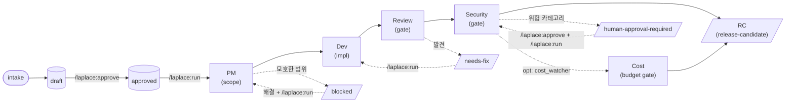

# Laplace

**언어:** [English](README.md) | 한국어

Laplace는 **로컬 AI 엔지니어링 루프 실행**을 위한 Claude Code 플러그입니다. 모델 능력이 아니라 **절차**를 강제합니다 — 분해 전 컨텍스트, 실행 전 로컬 이슈 상태, 리뷰 전 범위 한정 변경, 완료 전 검증, release-candidate 전 리뷰/보안 게이트, 되돌릴 수 없거나 외부 효과 전 인간 승인.

---

## 왜 Laplace인가

제약 없는 코딩 에이전트는 diff엔 보이지 않는 소프트웨어 엔지니어링 부분을 건너뜁니다 — 컨텍스트 읽기, 작업 범위 정하기, 증거 포착, 리뷰 위해 멈추기, 파괴적 행동 전 묻기. 모델은 종종 충분히 능력 있습니다. **절차**가 빠진 겁니다. 절차가 빠지면 결과는 옳아 보이지만 틀립니다 — 조용한 회귀, 범위 확장, 비밀 유출, 강제 푸시, 아무도 서명 안 한 "완료" 작업.

Laplace는 반대로 베팅합니다. 모델에게 자기 훈련을 요구하는 대신, 절차를 **결정론적**으로 만듭니다:

- 모델은 루프에 **지시**; Python이 전환을 **실행**.
- 상태는 `.harness/` 디스크에, 모델 메모리가 아니라 — 컴팩션·재시작·감사에서 생존.
- 위험 카테고리 — 자격증명, 프로덕션, 의존성, 네트워크, 릴리스 — **반드시** 인간 승인 게이트에서 멈춤. 정책은 모델이 약화 못 시킴.
- 모든 단계는 **증거**(테스트 출력, diff, 결정)를 실행 로그에 기록, report 스킬이 렌더.

목표는 자율이 아닙니다. 인간이 모든 되돌릴 수 없는 단계에서 끼어들고, 감사하고, 승인할 수 있는 **추적 가능하고, 검토 가능하고, 멈출 수 있는** 엔지니어링 루프입니다.

---

## 철학

| 원칙 | 실제 의미 |
|---|---|
| **능력보다 절차** | 모델은 실수하는 존재로 취급. 규율은 프롬프트가 아니라 코드(`scripts/state.py`, `scripts/policy.py`, `scripts/runner.py`)에. |
| **로컬 우선** | 모든 상태는 `.harness/` 로컬 파일. 클라우드·텔레메트리·프로덕션 접근 없음. |
| **완료 전 증거** | "다 했어"는 포착된 증거가 실행 로그에 있어야. `runner.py`가 전환 기록; 모델은 증거 없이 성공 선언 못 함. |
| **추측 말고 멈춤** | 모호함·차단·승인 필요 카테고리는 루프 정지. 인간이 해결 후 재개. |
| **보수적 기본값** | 설정 없이 동작. `.moon-cell/` 프로필은 선택, 있으면 소비. |
| **하드 안전 바닥** | Laplace 안전 정책은 프로젝트 설정·라우팅·프롬프트보다 우선. 모델이 못 낮춤. |

---

## 상태

초안. MVP 범위: P0–P6. 전체 사양은 `specs/SPEC-002-laplace-claude-code-plugin.md`.

## 0.6.0 새 기능

네 가지 opt-in 기능, 전부 기본 off — 업그레이드해도 기존 루프 안 변함:

- **타입별 증거 게이트** (SPEC-003) — `bug` 이슈는 dev 전 실패 재현 테스트 제시; `ui` 이슈는 보안 리뷰 전 시각 산출물 제시. `routing-rules.yml`로 데이터 구동.
- **업스트림 블로커 전파** (SPEC-004) — 이슈가 막히면 의존 이슈도 (전이적으로) 막힘. 반쯤 만든 트리에 디스패치 안 함.
- **비용 감시 게이트** (SPEC-006) — release-candidate 전 선택적 `cost-review` 단계; runtime / files-changed / token 예산 초과 시 정지.
- **동기 트리거** (SPEC-005) — cron/launchd용 `motivations.py --once` 단발 스케줄러: clock·git-upstream·idle·test-failure 신호로 승인 이슈 재개.

## 0.7.0 새 기능

- **Freerange 스코프 우회** (SPEC-007) — `/laplace:freerange on {flow|publish|supply|all}`가 승인 게이트 억제로 루프 무인 진행. 인간 전용, 스코프 제한, TTL 제한 (기본 24h, 최대 168h). **보안 경계 아님** — 결심된 에이전트는 우회 가능 (모든 policy hook과 동일 층). deny 층(`rm -rf /`, `curl|sh`, `sudo`, 클라우드 CLI)은 절대 억제 안 됨. 실용 패턴은 [`docs/freerange-recipes.kr.md`](docs/freerange-recipes.kr.md); 설계는 `specs/SPEC-007-freerange-scope-override.md`.

`CHANGELOG.md`와 `specs/SPEC-003..007-*.md` 참고.

---

## 요구사항

- [Claude Code](https://claude.com/claude-code) v2.x 이상
- Python 3.7+ (표준 라이브러리만 — Laplace는 `os.replace`, f-strings, `git`용 subprocess 사용)
- `git`이 PATH에 (루프가 브랜치 상태·PR 생성에 사용)
- `gh` CLI (`/laplace:create-pr`에만 필요; `gh auth login`으로 인증 필수)

---

## 설치

공개 GitHub 리포에서 설치. 한 경로 선택.

### 경로 A — 마켓플레이스 (권장)

이 리포를 플러그인 마켓플레이스로 추가 후 설치:

```
/plugin marketplace add tipsy-kereru/laplace
/plugin install laplace@laplace
```

업데이트는 마켓플레이스에서 해결. `.claude-plugin/plugin.json`과 `.claude-plugin/marketplace.json`의 `version` 필드 범프, 릴리스 태그하면 사용자가 `/plugin update laplace`로 받음.

### 경로 B — 직접 설치 (마켓플레이스 없이)

```
/plugin install tipsy-kereru/laplace
```

또는 전체 URL:

```
/plugin install https://github.com/tipsy-kereru/laplace
```

### 설치 확인

```
/laplace:doctor
```

`doctor`는 플러그인 JSON, 훅, Python 버전, git, `gh` 인증 점검. 그 후 런타임 작업공간 초기화:

```
/laplace:init
```

`.harness/` 생성 (Laplace 소유). 런타임 상태를 커밋하고 싶지 않으면 프로젝트 `.gitignore`에 `.harness/` 추가.

### 삭제

```
/plugin uninstall laplace
```

선택적으로 마켓플레이스 제거:

```
/plugin marketplace remove tipsy-kereru/laplace
```

플러그인 제거는 자체 파일만 삭제. `.harness/`의 프로젝트별 런타임 상태(이슈, 실행 로그, 승인)는 의도적으로 보존 — 깨끗이 하려면 직접 디렉토리 삭제.

---

## 설치 — Codex CLI (완전 동등)

Laplace는 Codex 플러그인으로도 설치됩니다. 마켓플레이스 추가 후 대화형 세션에서 설치:

```
codex plugin marketplace add tipsy-kereru/laplace
codex
```

`/plugins` 열고, `laplace` 마켓플레이스 선택, `laplace` 설치. 새 스레드 시작. 같은 설치가 Codex 데스크톱 앱도 커버 — 설치 후 앱 재시작하면 플러그인 인식.

### Claude Code와의 훅 동등

Codex는 플러그인 훅을 `hooks/hooks.json`에서 읽고 `CLAUDE_PLUGIN_ROOT`(와 `CLAUDE_PLUGIN_DATA`)를 Claude-Code 호환으로 설정 — 그래서 **모든 Laplace 훅이 Codex에서 동일하게 발화**:

| 훅 | Claude Code | Codex |
|---|---|---|
| SessionStart 활성화 (router.sh + Node `laplace-activate.js`) | 발화 | 발화 |
| UserPromptSubmit 신호 라우팅 (`router.sh`) | 발화 | 발화 (POSIX 호스트; Windows은 Node 활성화 훅 사용) |
| PreToolUse deny 층 + 승인 게이트 (`pretooluse.py`) | 발화 | **발화** |
| PostToolUse 증거 포착 (`posttooluse.py`) | 발화 | **발화** |
| Stop 루프 계속 (`stop-loop.py`) | 발화 | **발화** |

deny 층(`rm -rf /`, `curl|sh`, `sudo`, 클라우드 CLI), 증거 게이트, stop 루프가 Codex에서 Claude Code와 같은 방식으로 강제. "instruction-only" 다운그레이드 없음.

Codex 요구사항: PATH에 `python3` (Python 훅용), PATH에 `node` (SessionStart 활성화 훅용, Windows에서 `router.sh` 못 돌릴 때 사용).

### 글로벌 (VS Code Codex 확장, 모든 프로젝트)

VS Code Codex 확장은 `AGENTS.md`를 읽음. Laplace 절차를 글로벌로 실행하려면 이 리포의 [`AGENTS.kr.md`](AGENTS.kr.md)를 `~/.codex/AGENTS.md`로 복사. 프로젝트별로는 이 리포 체크아웃에서 Codex 실행 시 자동 로드.

### 업그레이드

```
codex plugin update laplace
```

### 삭제

```
codex plugin remove laplace
codex plugin marketplace remove tipsy-kereru/laplace   # 선택
```

플러그인 제거는 자체 파일만 삭제. `.harness/` 프로젝트 상태는 보존 — 깨끗이 하려면 직접 삭제.

### Codex에서 명령

Codex는 플러그인 명령을 `@`로 호출하는 스킬로 노출 (`/` 아님). 예: `@laplace:intake docs/prd.md`, `@laplace:run ISSUE-0001`, `@laplace:status`. Claude Code에서 `/laplace:*`인 명령이 Codex에선 `@laplace:*`.

---

## 사용 가이드

현실적 예시로 된 상세 안내(초기 설정, 버그 수정 루프, 의존성 게이트, 취소/재개, 막힌 이슈)는 **[docs/USAGE.kr.md](docs/USAGE.kr.md)**.

아래 퀵스타트는 정상 경로. 사용 가이드가 엣지 케이스 커버.

## 퀵스타트 — 엔드투엔드 루프

spec에서 PR까지 전형적 Laplace 세션:

```bash
# 1. PRD나 스토리 준비 (markdown). 예: docs/prd-login-rate-limit.md

# 2. 프로젝트 안의 Claude Code 세션에서:
/laplace:init                          # .harness/ 작업공간 생성 (최초 1회)
/laplace:doctor                        # 설치 점검
/laplace:intake docs/prd-login-rate-limit.md
#   → Laplace가 PRD 읽고 .harness/issues/에 드래프트 이슈 생성
/laplace:list                          # 드래프트 확인
/laplace:show ISSUE-001                # 범위, 인수 기준 검토
/laplace:approve ISSUE-001             # 드래프트 → 승인 큐 (인간 게이트)

/laplace:run ISSUE-001                 # 루프 실행
#   PM 단계 → Dev 단계 → Review 단계 → Security 단계
#   각 단계는 .harness/state/runs/<run-id>.json에 증거 기록
#   루프 정지: review-passed, blocked, human-approval-required

/laplace:status                        # 현 위치?
/laplace:logs <run-id>                 # 정제된 실행 로그 (비밀 마스킹)
/laplace:report ISSUE-001              # 이슈 리포트 렌더
/laplace:create-pr ISSUE-001           # 승인 후 GitHub PR 열기
/laplace:cancel ISSUE-001              # 막힌 루프 안전 정지 (상태 보존)
```

인간이 필요한 게이트(인증 변경, 의존성 추가, 릴리스, 프로덕션 접근)에서 루프가 **멈추고** 결정 표시. 해결 후 다시 `/laplace:run`으로 재개.

---

## 아키텍처

### 단계 파이프라인

승인된 각 이슈는 고정 단계 파이프라인을 통과. 단계는 자유형 프롬프트가 아니라 에이전트 **역할** — 각 에이전트는 제약된 계약.



승인된 각 이슈는 PM → Dev → Review → Security 통과. 어떤 게이트든 이슈를 `blocked`, `needs-fix`, `human-approval-required`로 전환 가능; 전환 해결 후 `/laplace:run` 재실행 시 마지막 합법 상태에서 재개.

- **PM** (`laplace-pm-agent`): 범위, 인수 기준, 기술 노트 명확화. 제한된 명확화 시도.
- **Dev** (`laplace-dev-agent`): 격리 브랜치 `laplace/<issue-id>`에 범위 변경 + 테스트 구현.
- **Review** (`laplace-review-agent`): 이슈 인수 기준 대비 독립 코드 리뷰.
- **Security** (`laplace-security-agent`): 보안 차원 리뷰 — 비밀, 인증, 권한, 인젝션, 의존성, MCP, 외부 API.
- **Release** (`laplace-release-agent`): review + security 통과 후에만 release-candidate 생성.

### 결정론적 스캐폴딩

모델은 루프에 지시; **Python이 전환 실행**. 모든 상태 이동은 `scripts/runner.py` 경유, `scripts/state.py`(상태머신 + 실행 로그)와 `scripts/policy.py`(deny-list 강제)의 기본 요소 조합.

```
Skills (SKILL.md)         → 모델에게 지시
  │
  ▼
scripts/runner.py         → 잠금 획득, 브랜치 생성, 상태 전환, 증거 기록
  ├── scripts/state.py    → 상태머신, 실행 로그, 승인 로그
  ├── scripts/policy.py   → 명령/경로 deny-list, 하드 안전 바닥
  ├── scripts/redaction.py → 모든 영속 필드에서 비밀 제거
  ├── scripts/validate.py → 전환 합법성 검증
  └── scripts/report.py   → 이슈 리포트 렌더
```

이 분리가 핵심: 모델이 증거 포착이나 상태 전환을 "잊을" 수 없음 — 스킬 지시가 항상 `runner.py` 경유.

### 훅

Laplace는 라우팅·강제를 위해 Claude Code 훅 등록:

| 훅 | 역할 |
|---|---|
| `PreToolUse` | 정책 점검 — 도구 실행 전 금지 명령/경로 deny |
| `PostToolUse` | 도구 행동 후 증거 포착, 상태 검증 |
| `Stop` | 루프 계속 — 재개, 인계, 정지 결정 |
| `SessionStart` | 세션 라우팅 컨텍스트 로드 |
| `UserPromptSubmit` | 활성 단계로 프롬프트 라우팅 |

모든 훅은 순수 표준 라이브러리 Python(`hooks/*.py`), `hooks/router.sh`가 라우팅. 네트워크·외부 서비스 없음.

### 상태 배치

```
.harness/
├── config.yml              # 프로젝트 오버라이드 (선택)
├── routing-rules.yml       # 단계 라우팅 (선택)
├── issues/                 # 드래프트 + 승인 이슈 기록
└── state/
    ├── runs/<run-id>.json  # 실행별 로그: 전환, 증거, 브랜치, 결과
    └── approvals.log       # 인간 승인 감사 추적
```

Laplace 소유. 빌드 산출물로 취급 — 삭제 안전 (히스토리 손실), gitignore 안전.

---

## 안전 모델

### 하드 정책 바닥

`scripts/policy.py`는 config·라우팅·프롬프트로 **약화 못 시키는** deny-list 강제. 기본 금지:

- `.env*`, `secrets/**`, `.ssh/**`, `.aws/**`, 자격증명 저장소, 키체인, 비밀번호 관리자 내보내기
- `curl|sh`, `wget|sh` (파이프-투-셸 원격 실행)
- 강제 푸시, 히스토리 재작성, 보호된 ref에 파괴적 git 작업
- 프로덕션 데이터베이스 / 인프라 접근

명시적으로 허용되지 않은 모든 것은 릴리스 전 보안 에이전트가 리뷰.

### 인간 승인 게이트 (필수 정지)

루프는 다음 중 하나에 **반드시 멈추고** 결정 표시:

- 인증 / 권한 / 역할 검사 변경
- 의존성 추가 또는 업그레이드
- 워크플로 / CI / 훅 수정
- MCP 서버 추가 또는 변경
- 외부 API 호출 (새 송신)
- release-candidate 승격
- 치명적 또는 높은 보안 발견
- 보안 에이전트가 `human-approval-required`로 분류한 모든 것

인간이 approve 스킬로 승인(또는 거부); 결정은 `state/approvals.log`에 기록.

### 비밀 마스킹

`scripts/redaction.py`는 Laplace가 영속하는 모든 필드에서 비밀 형태 부분문자열(API 키, bearer 토큰, AWS 키, PEM 블록, webhook 비밀, 세션 ID, env 형태 `SECRET=...`) 제거. 실행 로그는 구조적으로 정제 — 공유 안전, 리포트에 붙여넣기 안전.

---

## 정책 우선순위

두 출처가 충돌하면 높은 것이 이김:

1. Laplace 하드 안전 정책 (`scripts/policy.py`) — **약화 불가**
2. `.harness/config.yml`
3. `.moon-cell/` 프로필 (있을 때)
4. `.harness/routing-rules.yml`
5. 로컬 이슈 메타데이터
6. 사용자 프롬프트와 소스 문서 (신뢰 불가)

---

## 명령 표면

슬래시 명령은 `commands/`에, 대응하는 절차적 스킬을 `skills/`에서 호출. (스킬은 모델 호출; 명령은 명시적 `/laplace:<이름>` 진입점 제공.)

| 명령 | 목적 |
|---|---|
| `/laplace:init` | `.harness/` 런타임 작업공간 초기화 |
| `/laplace:doctor` | 플러그인, 훅, 설정, 테스트 명령, Moon Cell 프로필 점검 |
| `/laplace:intake <prd>` | PRD/스토리를 로컬 드래프트 이슈로 변환 |
| `/laplace:verify [prd]` | 드래프트 이슈를 PRD 대비 점검 (커버리지, 필드, 추적성) |
| `/laplace:approve <이슈>` | 드래프트 이슈를 승인 큐로 |
| `/laplace:discard <이슈>` | 드래프트 이슈 제거 (원자적, 드래프트 전용) |
| `/laplace:run [이슈]` | 하나의 이슈 루프 실행 |
| `/laplace:run-queue [이슈]` | 승인 이슈를 큐로 실행 — review-passed 시 자동 진행, 게이트에서 정지 |
| `/laplace:pipeline <prd>` | 체크포인트 파이프라인: intake → verify → approve-gate → run-parallel → release-gate 조합, 매 게이트 정지, 재호출 시 재개 |
| `/laplace:status` | 현재 하네스 상태 표시 |
| `/laplace:report <이슈>` | 이슈 리포트 생성 또는 표시 |
| `/laplace:cancel [이슈]` | 활성 루프 안전 정지 |
| `/laplace:create-pr <이슈>` | 승인 후 GitHub PR 생성 |
| `/laplace:release <X.Y.Z>` | 버전 릴리스: 8-점검 게이트, 3 파일 범프, 커밋, 태그, 푸시 (실패 시 정지) |
| `/laplace:list` | _(계획 — P5/P6)_ 로컬 이슈와 큐 상태 목록 |
| `/laplace:show <이슈>` | _(계획 — P5/P6)_ 이슈 상세 표시 |
| `/laplace:logs <run>` | _(계획 — P5/P6)_ 정제된 실행 로그 표시 |

---

## Laplace가 안 하는 것

- 하드 보안 샌드박스 주장 안 함 — 정책은 OS 격리가 아니라 도구/권한 층에서 강제
- 프로덕션 릴리스까지 자율 실행 안 함 — 모든 RC는 인간에게 정지
- 프로덕션 비밀, 데이터베이스, 인프라 접근 안 함
- Moon Cell 필수 아님 — 보수적 기본값으로 동작

---

## 진실의 원천

- 사용 가이드: `docs/USAGE.kr.md`
- 사양서: `specs/SPEC-002-laplace-claude-code-plugin.md`
- 하네스 설계 (이 프로젝트): `.moon-cell/docs/harness/`
- 런타임 상태: `.harness/` (Laplace 소유, `/laplace:init`이 생성)
- 버전: `VERSION`, `.claude-plugin/plugin.json`, `.claude-plugin/marketplace.json` (동기화 유지; 릴리스 워크플로가 셋 다 검증)

---

## 버전 관리와 릴리스

Laplace는 [Semantic Versioning](https://semver.org/) 따름. 버전은 세 곳에 기록, 동기화 유지 필수:

- `VERSION`
- `.claude-plugin/plugin.json` → `version`
- `.claude-plugin/marketplace.json` → `plugins[0].version`

`vX.Y.Z` 태깅이 `.github/workflows/release.yml` 트리거:

1. 태그 형태 검증 (`vX.Y.Z`)
2. 세 버전 파일이 태그와 일치 확인
3. 이전 태그 이후 커밋에서 릴리스 노트 생성
4. GitHub Release 생성 (또는 업데이트)

버전 불일치 시 릴리스 게시 전 워크플로 실패.
