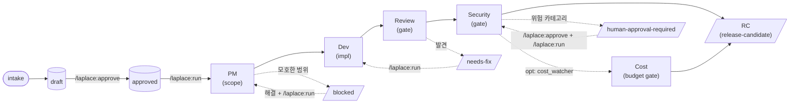

# Laplace

**언어:** [English](README.md) | 한국어

Laplace는 **로컬 AI 엔지니어링 루프를 실행**하는 Claude Code 플러그인입니다. 모델의 능력이 아니라 **절차**를 강제하는 것이 핵심입니다. 작업을 분해하기 전에 먼저 컨텍스트를 읽고, 실행하기 전에 로컬 이슈 상태를 확인하며, 리뷰를 통과하기 전에 변경 범위를 좁혀두고, 완료로 선언하기 전에 검증을 거치고, release-candidate로 올리기 전에 리뷰와 보안 게이트를 통과하며, 되돌릴 수 없거나 외부에 영향을 주는 행동을 하기 전에는 반드시 사람이 승인하도록 만듭니다.

---

## 왜 Laplace가 필요한가

제약 없이 동작하는 코딩 에이전트는 diff만 봐서는 알 수 없는 소프트웨어 엔지니어링의 부분들을 자주 건너뜁니다. 컨텍스트를 읽고, 작업 범위를 정하고, 증거를 남기고, 리뷰를 위해 잠시 멈추고, 파괴적인 행동을 하기 전에 묻는 일들이 그것입니다. 모델 자체는 대부분 충분한 능력을 갖추고 있습니다. 문제는 **절차가 빠져 있다**는 점입니다. 절차가 빠지면 결과는 겉보기엔 맞지만 실제로는 틀리게 됩니다. 조용한 회귀가 끼어들고, 작업 범위가 불어나고, 비밀이 새어나가고, 강제 푸시가 일어나고, 아무도 서명하지 않은 작업이 "완료"로 선언되는 식입니다.

Laplace는 정반대의 선택을 합니다. 모델이 스스로 절제하길 바라는 대신, 절차 자체를 **결정론적으로** 만듭니다.

- 모델은 루프에 **지시**를 내리고, Python이 상태 전환을 **실행**합니다.
- 상태는 모델의 메모리가 아니라 `.harness/` 디스크에 저장됩니다. 그래서 컨팩션과 재시작, 감사를 거쳐도 살아남습니다.
- 위험한 카테고리, 즉 자격 증명, 프로덕션, 의존성, 네트워크, 릴리스는 **반드시** 사람의 승인 게이트에서 멈춥니다. 이 정책은 모델이 약화할 수 없습니다.
- 모든 단계는 **증거**(테스트 출력, diff, 결정)를 실행 로그에 기록하며, report 스킬이 이를 보기 좋게 렌더링합니다.

목표는 자율이 아닙니다. 사람이 되돌릴 수 없는 모든 단계에서 끼어들고, 감사하고, 승인할 수 있는 **추적 가능하고 검토 가능하며 언제든 멈출 수 있는** 엔지니어링 루프를 만드는 것입니다.

---

## 철학

| 원칙 | 실제로 의미하는 바 |
|---|---|
| **능력보다 절차** | 모델을 실수할 수 있는 존재로 취급합니다. 규율은 프롬프트가 아니라 코드(`scripts/state.py`, `scripts/policy.py`, `scripts/runner.py`)에 존재합니다. |
| **로컬 우선** | 모든 상태는 `.harness/` 아래 로컬 파일입니다. 클라우드도, 텔레메트리도, 프로덕션 접근도 없습니다. |
| **완료 전 증거** | "다 했습니다"라는 말은 실행 로그에 포착된 증거가 있어야 성립합니다. `runner.py`가 전환을 기록하므로, 모델은 증거 없이 성공을 선언할 수 없습니다. |
| **추측하지 말고 멈추기** | 모호함, 차단, 승인이 필요한 카테고리를 만나면 루프가 멈춥니다. 사람이 해결한 뒤에 재개합니다. |
| **보수적인 기본값** | 설정 없이도 동작합니다. `.moon-cell/` 프로필은 선택 사항이며, 있을 때만 소비됩니다. |
| **단단한 안전 바닥** | Laplace의 안전 정책은 프로젝트 설정, 라우팅 규칙, 프롬프트보다 우선합니다. 모델이 이를 낮출 수는 없습니다. |

---

## 상태

초안입니다. MVP 범위는 P0~P6입니다. (설계 노트는 소스 저장소의 `specs/` 디렉토리에 있으며, 플러그인 릴리스에는 함께 번들되지 않습니다.)

## 0.6.0에서 새로워진 점

네 가지 opt-in 기능이 추가되었으며, 모두 기본값은 off입니다. 그래서 기존 루프의 동작은 업그레이드해도 변하지 않습니다.

- **타입별 증거 게이트** (SPEC-003) — `bug` 이슈는 dev 단계에 들어가기 전에 실패하는 재현 테스트를 보여야 하고, `ui` 이슈는 보안 리뷰 전에 시각 산출물을 보여야 합니다. `routing-rules.yml`로 데이터 기반으로 동작합니다.
- **업스트림 블로커 전파** (SPEC-004) — 한 이슈가 막히면 그것에 의존하는 이슈들도 (전이적으로 함께) 막힙니다. 반쯤 만들어진 트리에 이슈를 디스패치하는 일이 사라집니다.
- **비용 감시 게이트** (SPEC-006) — release-candidate 전에 선택적으로 거치는 `cost-review` 단계로, 실행 시간이나 변경 파일 수, 토큰 예산이 한계를 넘으면 루프가 멈춥니다.
- **동기 트리거** (SPEC-005) — cron이나 launchd에서 부를 수 있는 `motivations.py --once` 단발 스케줄러로, 시간, git 업스트림, 유휴, 테스트 실패 신호를 받아 승인된 이슈를 재개합니다.

## 0.7.0에서 새로워진 점

- **Freerange 스코프 우회** (SPEC-007) — `/laplace:freerange on {flow|publish|supply|all}`가 승인 게이트를 억제해서 루프가 무인으로 진행되도록 만듭니다. 사람만 켤 수 있고, 스코프로 제한되며, TTL(기본 24시간, 최대 168시간)로 제한됩니다. **보안 경계는 아닙니다.** 결심한 에이전트라면 우회할 수 있으며, 이는 모든 policy hook과 같은 층입니다. deny 층(`rm -rf /`, `curl|sh`, `sudo`, 클라우드 CLI)은 절대 억제되지 않습니다. 실용적인 사용 패턴은 [`docs/freerange-recipes.kr.md`](docs/freerange-recipes.kr.md)에 정리되어 있습니다.

전체 버전 히스토리는 `CHANGELOG.md`를 참고하세요.

---

## 요구사항

- [Claude Code](https://claude.com/claude-code) v2.x 이상
- Python 3.7 이상 (표준 라이브러리만 사용 — Laplace는 `os.replace`, f-string, `git` 호출을 위한 subprocess를 사용합니다)
- `git`이 PATH에 있을 것 (루프가 브랜치 상태와 PR 생성에 사용)
- `gh` CLI (`/laplace:create-pr`에만 필요하며, `gh auth login`으로 인증되어 있어야 함)

---

## 설치

공개 GitHub 저장소에서 설치합니다. 아래 두 경로 중 하나를 선택하세요.

### 경로 A — 마켓플레이스 (권장)

이 저장소를 플러그인 마켓플레이스로 추가한 뒤 설치합니다.

```
/plugin marketplace add tipsy-kereru/laplace
/plugin install laplace@laplace
```

업데이트는 마켓플레이스를 통해 해결됩니다. `.claude-plugin/plugin.json`과 `.claude-plugin/marketplace.json`의 `version` 필드를 올리고 릴리스 태그를 붙이면, 사용자가 `/plugin update laplace`로 받을 수 있습니다.

### 경로 B — 마켓플레이스 없이 직접 설치

```
/plugin install tipsy-kereru/laplace
```

또는 전체 URL로 설치할 수도 있습니다.

```
/plugin install https://github.com/tipsy-kereru/laplace
```

### 설치 확인

```
/laplace:doctor
```

`doctor`는 플러그인 JSON, 훅, Python 버전, git, `gh` 인증을 점검합니다. 그런 다음 런타임 작업 공간을 초기화합니다.

```
/laplace:init
```

이 명령은 `.harness/` 디렉토리(Laplace가 소유)를 만듭니다. 런타임 상태를 커밋하고 싶지 않다면 프로젝트의 `.gitignore`에 `.harness/`를 추가하세요.

### 삭제

```
/plugin uninstall laplace
```

원한다면 마켓플레이스도 제거할 수 있습니다.

```
/plugin marketplace remove tipsy-kereru/laplace
```

플러그인을 제거해도 플러그인 자체 파일만 지워집니다. `.harness/` 아래에 있는 프로젝트별 런타임 상태(이슈, 실행 로그, 승인 기록)는 의도적으로 남겨둡니다. 완전히 비우고 싶다면 해당 디렉토리를 직접 삭제하면 됩니다.

---

## 설치 — Codex CLI (완전 동등)

Laplace는 Codex 플러그인으로도 설치할 수 있습니다. 마켓플레이스를 추가한 뒤, 대화형 세션 안에서 설치합니다.

```
codex plugin marketplace add tipsy-kereru/laplace
codex
```

`/plugins`를 열고 `laplace` 마켓플레이스를 선택한 다음 `laplace`를 설치합니다. 그러고는 새 스레드를 시작하면 됩니다. 이 설치는 Codex 데스크톱 앱에도 그대로 적용됩니다. 설치 후 앱을 재시작하면 플러그인을 인식합니다.

### Claude Code와의 훅 동등

Codex는 플러그인 훅을 `hooks/hooks.json`에서 읽어오고, Claude Code 호환을 위해 `CLAUDE_PLUGIN_ROOT`와 `CLAUDE_PLUGIN_DATA` 환경 변수를 설정합니다. 그 결과 **모든 Laplace 훅이 Codex에서도 동일하게 발화**합니다.

| 훅 | Claude Code | Codex |
|---|---|---|
| SessionStart 활성화 (router.sh + Node `laplace-activate.js`) | 발화 | 발화 |
| UserPromptSubmit 신호 라우팅 (`router.sh`) | 발화 | 발화 (POSIX 호스트에서. Windows에서는 Node 활성화 훅 사용) |
| PreToolUse deny 층 + 승인 게이트 (`pretooluse.py`) | 발화 | **발화** |
| PostToolUse 증거 포착 (`posttooluse.py`) | 발화 | **발화** |
| Stop 루프 계속 (`stop-loop.py`) | 발화 | **발화** |

deny 층(`rm -rf /`, `curl|sh`, `sudo`, 클라우드 CLI), 증거 게이트, stop 루프는 Codex에서도 Claude Code와 같은 방식으로 강제합니다. "instruction-only"로 동작이 내려가는 일은 없습니다.

Codex에서의 요구사항은 PATH에 `python3`가 있을 것(Python 훅용), 그리고 PATH에 `node`가 있을 것(SessionStart 활성화 훅용, Windows에서 `router.sh`를 실행할 수 없을 때 사용)입니다.

### 글로벌 사용 (VS Code Codex 확장, 모든 프로젝트)

VS Code의 Codex 확장은 `AGENTS.md`를 읽습니다. Laplace의 절차를 모든 프로젝트에 전역으로 적용하려면 이 저장소의 [`AGENTS.kr.md`](AGENTS.kr.md)를 `~/.codex/AGENTS.md`로 복사하세요. 프로젝트 단위로는 이 저장소를 체크아웃한 채로 Codex를 실행하면 자동으로 로드됩니다.

### 업그레이드

```
codex plugin update laplace
```

### 삭제

```
codex plugin remove laplace
codex plugin marketplace remove tipsy-kereru/laplace   # 선택
```

플러그인을 제거해도 자체 파일만 지워집니다. `.harness/`의 프로젝트 상태는 의도적으로 보존되므로, 완전히 비우려면 직접 삭제해야 합니다.

### Codex에서 명령 사용

Codex는 플러그인 명령을 `/`가 아니라 `@`로 부르는 스킬로 노출합니다. 예를 들어 `@laplace:intake docs/prd.md`, `@laplace:run ISSUE-0001`, `@laplace:status`처럼 씁니다. Claude Code에서 `/laplace:*`였던 명령은 Codex에서는 `@laplace:*`가 됩니다.

---

## 사용 가이드

현실적인 예시로 이루어진 상세 안내(최초 설정, 버그 수정 루프, 의존성 게이트, 취소와 재개, 막힌 이슈)는 **[docs/USAGE.kr.md](docs/USAGE.kr.md)**에 있습니다.

아래의 퀵스타트는 정상 경로를 다루고, 사용 가이드는 예외 상황을 다룹니다.

## 퀵스타트 — 엔드투엔드 루프

spec에서 PR까지, 전형적인 Laplace 세션은 이렇게 흘러갑니다.

```bash
# 1. PRD나 스토리를 markdown으로 준비합니다. 예: docs/prd-login-rate-limit.md

# 2. 프로젝트 안에서 Claude Code 세션을 엽니다.
/laplace:init                          # .harness/ 작업 공간 생성 (최초 한 번)
/laplace:doctor                        # 설치가 건강한지 점검
/laplace:intake docs/prd-login-rate-limit.md
#   → Laplace가 PRD를 읽고 .harness/issues/ 아래에 드래프트 이슈를 만듭니다
/laplace:list                          # 드래프트를 봅니다
/laplace:show ISSUE-001                # 범위와 인수 기준을 검토합니다
/laplace:approve ISSUE-001             # 드래프트를 승인 큐로 옮깁니다 (사람 게이트)

/laplace:run ISSUE-001                 # 루프를 실행합니다
#   PM 단계 → Dev 단계 → Review 단계 → Security 단계
#   각 단계는 .harness/state/runs/<run-id>.json에 증거를 기록합니다
#   루프는 review-passed, blocked, human-approval-required에서 멈춥니다

/laplace:status                        # 지금 어디쯤인지 확인
/laplace:logs <run-id>                 # 비밀이 마스킹된 실행 로그
/laplace:report ISSUE-001              # 이슈 리포트를 렌더링
/laplace:create-pr ISSUE-001           # 승인 후 GitHub PR을 엽니다
/laplace:cancel ISSUE-001              # 막힌 루프를 안전하게 멈춥니다 (상태는 보존)
```

사람이 필요한 게이트(인증 변경, 의존성 추가, 릴리스, 프로덕션 접근)에서 루프는 **멈추고** 결정을 사용자에게 맡깁니다. 해결한 뒤에 다시 `/laplace:run`을 실행하면 재개됩니다.

---

## 아키텍처

### 단계 파이프라인

승인된 각 이슈는 고정된 단계 파이프라인을 따라 흐릅니다. 단계는 자유로운 형태의 프롬프트가 아니라 에이전트 **역할**입니다. 각 에이전트는 제약이 걸린 계약을 따릅니다.



승인된 이슈는 PM → Dev → Review → Security를 차례로 거칩니다. 어떤 게이트든 이슈를 `blocked`, `needs-fix`, `human-approval-required`로 빼돌릴 수 있습니다. 그 빼돌림을 해결하고 다시 `/laplace:run`을 실행하면 마지막 합법 상태에서 재개됩니다.

- **PM** (`laplace-pm-agent`): 범위, 인수 기준, 기술 노트를 명확히 합니다. 명확화 시도 횟수에 상한이 있습니다.
- **Dev** (`laplace-dev-agent`): 격리된 브랜치 `laplace/<issue-id>` 위에서 범위에 맞는 변경과 테스트를 구현합니다.
- **Review** (`laplace-review-agent`): 이슈의 인수 기준을 기준으로 독립적인 코드 리뷰를 수행합니다.
- **Security** (`laplace-security-agent`): 보안 차원의 리뷰를 수행합니다. 비밀, 인증, 권한, 인젝션, 의존성, MCP, 외부 API를 다룹니다.
- **Release** (`laplace-release-agent`): review와 security를 통과한 뒤에만 release-candidate를 만듭니다.

### 결정론적 스캐폴딩

모델은 루프에 **지시**를 내리고, **Python이 상태 전환을 실행**합니다. 모든 상태 이동은 `scripts/runner.py`를 거치며, 거기서 `scripts/state.py`(상태머신과 실행 로그)와 `scripts/policy.py`(deny-list 강제)의 기본 요소를 조합합니다.

```
Skills (SKILL.md)         → 모델에게 지시를 내립니다
  │
  ▼
scripts/runner.py         → 잠금을 획득하고, 브랜치를 만들고, 상태를 전환하고, 증거를 기록합니다
  ├── scripts/state.py    → 상태머신, 실행 로그, 승인 로그
  ├── scripts/policy.py   → 명령/경로 deny-list, 단단한 안전 바닥
  ├── scripts/redaction.py → 영속되는 모든 필드에서 비밀을 제거
  ├── scripts/validate.py → 전환이 합법적인지 검증
  └── scripts/report.py   → 이슈 리포트 렌더링
```

이 분리가 이 시스템의 핵심입니다. 모델이 증거를 남기는 일이나 상태를 전환하는 일을 "잊어버릴" 수 없습니다. 왜냐하면 스킬의 지시는 언제나 `runner.py`를 거치도록 되어 있기 때문입니다.

### 훅

Laplace는 라우팅과 강제를 위해 Claude Code 훅을 등록합니다.

| 훅 | 역할 |
|---|---|
| `PreToolUse` | 정책 점검 — 도구가 실행되기 전에 금지된 명령과 경로를 deny합니다 |
| `PostToolUse` | 도구 행위 이후에 증거를 포착하고 상태를 검증합니다 |
| `Stop` | 루프 계속 — 재개할지, 인계할지, 멈출지 결정합니다 |
| `SessionStart` | 세션을 위한 라우팅 컨텍스트를 불러옵니다 |
| `UserPromptSubmit` | 활성 단계를 통해 프롬프트를 라우팅합니다 |

모든 훅은 순수 표준 라이브러리 Python(`hooks/*.py`)이며, `hooks/router.sh`가 라우팅합니다. 네트워크도 외부 서비스도 사용하지 않습니다.

### 상태 배치

```
.harness/
├── config.yml              # 프로젝트 오버라이드 (선택)
├── routing-rules.yml       # 단계 라우팅 (선택)
├── issues/                 # 드래프트와 승인 이슈 기록
└── state/
    ├── runs/<run-id>.json  # 실행별 로그: 전환, 증거, 브랜치, 결과
    └── approvals.log       # 사람 승인 감사 추적
```

Laplace가 소유합니다. 빌드 산출물처럼 다루세요. 삭제해도 (히스토리를 잃을 뿐) 안전하고, gitignore해도 안전합니다.

---

## 안전 모델

### 단단한 정책 바닥

`scripts/policy.py`는 config와 라우팅 규칙, 프롬프트 어느 것으로도 **약화할 수 없는** deny-list를 강제합니다. 기본적으로 금지되는 것은 다음과 같습니다.

- `.env*`, `secrets/**`, `.ssh/**`, `.aws/**`, 자격 증명 저장소, 키체인, 비밀번호 관리자 내보내기
- `curl|sh`, `wget|sh` (파이프로 셸에 먹이는 원격 실행)
- 강제 푸시, 히스토리 재작성, 보호된 ref에 대한 파괴적 git 작업
- 프로덕션 데이터베이스와 인프라 접근

명시적으로 허용되지 않은 모든 것은 릴리스 전에 보안 에이전트가 리뷰합니다.

### 사람 승인 게이트 (필수 정지)

루프는 다음 중 하나에 해당할 때 **반드시 멈추고** 결정을 사용자에게 맡깁니다.

- 인증 / 권한 / 역할 검사 변경
- 의존성 추가 또는 업그레이드
- 워크플로 / CI / 훅 수정
- MCP 서버 추가 또는 변경
- 외부 API 호출 (새로운 송신)
- release-candidate로의 승격
- 치명적이거나 높은 수준의 보안 발견
- 보안 에이전트가 `human-approval-required`으로 분류한 모든 것

사람이 approve 스킬로 승인(또는 거부)하며, 그 결정은 `state/approvals.log`에 기록됩니다.

### 비밀 마스킹

`scripts/redaction.py`는 Laplace가 영속하는 모든 필드에서 비밀 형태의 부분 문자열(API 키, bearer 토큰, AWS 키, PEM 블록, webhook 비밀, 세션 ID, env 형태의 `SECRET=...`)을 제거합니다. 실행 로그는 구조적으로 정제되어 있어 공유해도 안전하고, 리포트에 붙여 넣어도 안전합니다.

---

## 정책 우선순위

두 출처가 충돌하면 우선순위가 높은 쪽이 이깁니다.

1. Laplace의 단단한 안전 정책 (`scripts/policy.py`) — **약화 불가**
2. `.harness/config.yml`
3. `.moon-cell/` 프로필 (있을 때)
4. `.harness/routing-rules.yml`
5. 로컬 이슈 메타데이터
6. 사용자 프롬프트와 소스 문서 (신뢰하지 않음)

---

## 명령 표면

슬래시 명령은 `commands/`에 있으며, 대응하는 절차적 스킬을 `skills/`에서 호출합니다. (스킬은 모델이 호출하지만, 명령은 명시적인 `/laplace:<이름>` 진입점을 사용자에게 제공합니다.)

| 명령 | 목적 |
|---|---|
| `/laplace:init` | `.harness/` 런타임 작업 공간을 초기화합니다 |
| `/laplace:doctor` | 플러그인, 훅, 설정, 테스트 명령, Moon Cell 프로필을 점검합니다 |
| `/laplace:intake <prd>` | PRD나 스토리를 로컬 드래프트 이슈로 변환합니다 |
| `/laplace:verify [prd]` | 드래프트 이슈를 PRD와 대조해 점검합니다 (커버리지, 필드, 추적성) |
| `/laplace:approve <이슈>` | 드래프트 이슈를 승인 큐로 옮깁니다 |
| `/laplace:discard <이슈>` | 드래프트 이슈를 제거합니다 (원자적, 드래프트 전용) |
| `/laplace:run [이슈]` | 하나의 이슈 루프를 실행합니다 |
| `/laplace:run-queue [이슈]` | 승인된 이슈들을 큐로 실행합니다 — review-passed에서 자동 진행, 게이트에서 정지 |
| `/laplace:pipeline <prd>` | 체크포인트 파이프라인: intake → verify → approve-gate → run-parallel → release-gate를 조합, 매 게이트에서 정지, 재호출 시 재개 |
| `/laplace:status` | 현재 하네스 상태를 보여줍니다 |
| `/laplace:report <이슈>` | 이슈 리포트를 생성하거나 보여줍니다 |
| `/laplace:cancel [이슈]` | 활성 루프를 안전하게 멈춥니다 |
| `/laplace:create-pr <이슈>` | 승인 후 GitHub PR을 만듭니다 |
| `/laplace:release <X.Y.Z>` | 버전을 릴리스합니다: 8-점검 게이트, 3개 파일 범프, 커밋, 태그, 푸시 (실패 시 정지) |
| `/laplace:list` | _(계획 — P5/P6)_ 로컬 이슈와 큐 상태를 나열합니다 |
| `/laplace:show <이슈>` | _(계획 — P5/P6)_ 이슈 상세를 보여줍니다 |
| `/laplace:logs <run>` | _(계획 — P5/P6)_ 정제된 실행 로그를 보여줍니다 |

---

## Laplace가 하지 않는 일

- 하드 보안 샌드박스를 주장하지 않습니다. 정책은 OS 격리가 아니라 도구와 권한 층에서 강제됩니다.
- 프로덕션 릴리스까지 자율로 실행하지 않습니다. 모든 RC는 사람에게 멈춥니다.
- 프로덕션 비밀, 데이터베이스, 인프라에 접근하지 않습니다.
- Moon Cell을 요구하지 않습니다. 보수적인 기본값으로 동작합니다.

---

## 진실의 원천

- 사용 가이드: `docs/USAGE.kr.md`
- 사양서: 설계 노트는 소스 저장소의 `specs/` 디렉토리에 있습니다 (플러그인 릴리스에는 번들되지 않음)
- 하네스 설계 (이 프로젝트): `.moon-cell/docs/harness/`
- 런타임 상태: `.harness/` (Laplace 소유, `/laplace:init`이 생성)
- 버전: `VERSION`, `.claude-plugin/plugin.json`, `.claude-plugin/marketplace.json` (셋이 동기화되어야 하며, 릴리스 워크플로가 셋을 모두 검증)

---

## 버전 관리와 릴리스

Laplace는 [Semantic Versioning](https://semver.org/)을 따릅니다. 버전은 세 곳에 기록되며, 서로 동기화되어야 합니다.

- `VERSION`
- `.claude-plugin/plugin.json` → `version`
- `.claude-plugin/marketplace.json` → `plugins[0].version`

`vX.Y.Z` 태그를 붙이면 `.github/workflows/release.yml`이 실행됩니다. 이 워크플로는 다음을 수행합니다.

1. 태그 형태(`vX.Y.Z`)를 검증합니다.
2. 세 버전 파일이 태그와 일치하는지 확인합니다.
3. 이전 태그 이후의 커밋에서 릴리스 노트를 생성합니다.
4. GitHub Release를 만들거나 업데이트합니다.

버전이 어긋나면 릴리스가 게시되기 전에 워크플로가 실패합니다.
