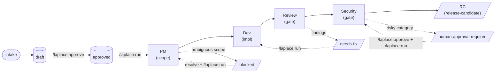

# Laplace

Laplace is a Claude Code plugin for **local AI engineering loop execution**. It enforces procedure, not model capability: context before decomposition, local issue state before execution, scoped changes before review, verification before completion, review/security gates before release-candidate, and human approval before irreversible or external side effects.

---

## Why Laplace

Unconstrained coding agents skip the parts of software engineering that are invisible from the diff: reading context, scoping work, capturing evidence, pausing for review, and asking before destructive actions. The model is often capable enough; the **procedure** is missing. When the procedure is missing, the output looks right and is wrong — quiet regressions, scope creep, secret leakage, force-pushes, and "completed" work that no one signed off on.

Laplace takes the opposite bet. Instead of asking the model to self-discipline, it makes the procedure **deterministic**:

- The model **instructs** the loop; Python **executes** the transitions.
- State lives on disk in `.harness/`, not in the model's memory, so it survives compaction, restart, and audit.
- Risky categories — credentials, production, dependencies, network, release — **must stop** at a human approval gate. The policy cannot be weakened by the model.
- Every phase writes **evidence** (test output, diffs, decisions) to a run log that the report skill renders.

The goal is not autonomy. It is **traceable, reviewable, stoppable** engineering loops that a human can interrupt, audit, and approve at every irreversible step.

---

## Philosophy

| Principle | What it means in practice |
|---|---|
| **Procedure over capability** | The model is treated as fallible. Discipline lives in code (`scripts/state.py`, `scripts/policy.py`, `scripts/runner.py`), not in prompts. |
| **Local-first** | All state is local files under `.harness/`. No cloud, no telemetry, no production access. |
| **Evidence before claim** | "Done" requires a run-log entry with captured proof. `runner.py` records transitions; the model cannot declare success without it. |
| **Stop, don't guess** | Ambiguity, blockers, and approval-required categories halt the loop. The human resolves, then resumes. |
| **Conservative defaults** | Works with zero config. `.moon-cell/` profiles are optional, consumed when present. |
| **Hard safety floor** | Laplace's safety policy overrides project config, routing rules, and prompts. The model cannot lower it. |

---

## Status

Draft. MVP scope: P0–P6. See `specs/SPEC-002-laplace-claude-code-plugin.md` for the full specification.

---

## Requirements

- [Claude Code](https://claude.com/claude-code) v2.x or later
- Python 3.7+ (stdlib only — Laplace uses `os.replace`, f-strings, and subprocess for `git`)
- `git` on `PATH` (used by the run loop for branch state and PR creation)
- `gh` CLI (only required for `/laplace:create-pr`; must be authenticated via `gh auth login`)

---

## Installation

Install from the public GitHub repository. Pick one path.

### Path A — Marketplace (recommended)

Add this repository as a plugin marketplace, then install:

```
/plugin marketplace add tipsy-kereru/laplace
/plugin install laplace@laplace
```

Updates are resolved against the marketplace. Bump the `version` field in `.claude-plugin/plugin.json` and `.claude-plugin/marketplace.json`, tag a release, and users can `/plugin update laplace`.

### Path B — Direct install (no marketplace)

```
/plugin install tipsy-kereru/laplace
```

Or by full URL:

```
/plugin install https://github.com/tipsy-kereru/laplace
```

### Verify the install

```
/laplace:doctor
```

`doctor` checks the plugin JSON, hooks, Python version, git, and `gh` auth. Then initialize the runtime workspace:

```
/laplace:init
```

This creates `.harness/` (owned by Laplace). Add `.harness/` to your project `.gitignore` if you do not want to commit runtime state.

### Uninstall

```
/plugin uninstall laplace
```

Optionally remove the marketplace:

```
/plugin marketplace remove tipsy-kereru/laplace
```

---

## Usage guide

For detailed walkthroughs with realistic examples (first-time setup, bug-fix loop, dependency gate, cancel/resume, blocked issues), see **[docs/USAGE.md](docs/USAGE.md)**.

The quick start below covers the happy path. The usage guide covers the edge cases.

## Quick start — an end-to-end loop

A typical Laplace session, from spec to PR:

```bash
# 1. Prepare a PRD or story (markdown). E.g. docs/prd-login-rate-limit.md

# 2. In a Claude Code session inside your project:
/laplace:init                          # create .harness/ workspace (one-time)
/laplace:doctor                        # sanity-check the install
/laplace:intake docs/prd-login-rate-limit.md
#   → Laplace reads the PRD, emits draft issues under .harness/issues/
/laplace:list                          # see drafts
/laplace:show ISSUE-001                # review scope, acceptance criteria
/laplace:approve ISSUE-001             # move draft → approved queue (human gate)

/laplace:run ISSUE-001                 # execute the loop
#   PM phase → Dev phase → Review phase → Security phase
#   Each phase writes evidence to .harness/state/runs/<run-id>.json
#   Loop halts at: review-passed, blocked, or human-approval-required

/laplace:status                        # where are we?
/laplace:logs <run-id>                 # sanitized run log (secrets redacted)
/laplace:report ISSUE-001              # render the issue report
/laplace:create-pr ISSUE-001           # open a GitHub PR after approval
/laplace:cancel ISSUE-001              # stop a stuck loop safely (keeps state)
```

At any gate that needs a human (auth change, dependency add, release, production touch), the loop **stops** and surfaces the decision. Resolve it, then `/laplace:run` again to resume.

---

## Architecture

### Phase pipeline

Each approved issue flows through a fixed phase pipeline. Phases are agent **roles**, not free-form prompts — each agent has a constrained contract.



Each approved issue flows through PM → Dev → Review → Security. Any gate can divert the issue to `blocked`, `needs-fix`, or `human-approval-required`; resolving the diversion and re-running `/laplace:run` resumes from the last legal state.

- **PM** (`laplace-pm-agent`): clarifies scope, acceptance criteria, technical notes. Bounded clarification attempts.
- **Dev** (`laplace-dev-agent`): implements scoped changes + tests on an isolated branch `laplace/<issue-id>`.
- **Review** (`laplace-review-agent`): independent code review against the issue's acceptance criteria.
- **Security** (`laplace-security-agent`): security dimension review — secrets, auth, permissions, injection, dependencies, MCP, external APIs.
- **Release** (`laplace-release-agent`): produces a release-candidate only after review + security pass.

### Deterministic scaffolding

The model instructs the loop; **Python executes the transitions**. Every state move goes through `scripts/runner.py`, which composes primitives from `scripts/state.py` (state machine + run log) and `scripts/policy.py` (deny-list enforcement).

```
Skills (SKILL.md)         → instruct the model
  │
  ▼
scripts/runner.py         → acquire lock, create branch, transition state, write evidence
  ├── scripts/state.py    → state machine, run log, approval log
  ├── scripts/policy.py   → command/path deny-list, hard safety floor
  ├── scripts/redaction.py → strip secrets from every persisted field
  ├── scripts/validate.py → verify transitions are legal
  └── scripts/report.py   → render issue reports
```

This separation is the whole point: the model cannot "forget" to capture evidence or transition state, because the skill's instructions always route through `runner.py`.

### Hooks

Laplace registers Claude Code hooks for routing and enforcement:

| Hook | Role |
|---|---|
| `PreToolUse` | Policy check — deny prohibited commands/paths before the tool runs |
| `PostToolUse` | Evidence capture, state validation after a tool action |
| `Stop` | Loop continuation — decide whether to resume, hand off, or halt |
| `SessionStart` | Load routing context for the session |
| `UserPromptSubmit` | Route prompts through the active phase |

All hooks are pure stdlib Python (`hooks/*.py`) routed by `hooks/router.sh`. No network, no external services.

### State layout

```
.harness/
├── config.yml              # project overrides (optional)
├── routing-rules.yml       # phase routing (optional)
├── issues/                 # draft + approved issue records
└── state/
    ├── runs/<run-id>.json  # per-run log: transitions, evidence, branch, outcome
    └── approvals.log       # human approval audit trail
```

Owned by Laplace. Treat as build artifacts — safe to delete (loses history), safe to gitignore.

---

## Safety model

### Hard policy floor

`scripts/policy.py` enforces a deny-list that **cannot be weakened** by config, routing rules, or prompts. Prohibited by default:

- `.env*`, `secrets/**`, `.ssh/**`, `.aws/**`, credential stores, keychains, password-manager exports
- `curl|sh`, `wget|sh` (pipe-to-shell remote execution)
- Force-push, history rewrite, destructive git operations on protected refs
- Production database / infrastructure access

Anything not explicitly allowed is reviewed by the security agent before release.

### Human approval gates (mandatory stop)

The loop **must halt** and surface a decision for any of:

- Auth / permission / role-check changes
- Dependency additions or upgrades
- Workflow / CI / hook modifications
- MCP server additions or changes
- External API calls (new egress)
- Release-candidate promotion
- Critical or high security findings
- Anything the security agent classifies as `human-approval-required`

The human approves (or rejects) via the approve skill; the decision is logged to `state/approvals.log`.

### Secret redaction

`scripts/redaction.py` strips secret-shaped substrings (API keys, bearer tokens, AWS keys, PEM blocks, webhook secrets, session IDs, env-style `SECRET=...`) from every field Laplace persists. The run log is sanitized by construction — safe to share, safe to paste into a report.

---

## Policy precedence

When two sources disagree, higher wins:

1. Laplace hard safety policy (`scripts/policy.py`) — **cannot be weakened**
2. `.harness/config.yml`
3. `.moon-cell/` profile (when present)
4. `.harness/routing-rules.yml`
5. Local issue metadata
6. User prompt and source documents (untrusted)

---

## Command surface

Slash commands live in `commands/` and invoke the corresponding procedural skill in `skills/`. (Skills are model-invoked; commands give you explicit `/laplace:<name>` entry points.)

| Command | Purpose |
|---|---|
| `/laplace:init` | Initialize `.harness/` runtime workspace |
| `/laplace:doctor` | Check plugin, hooks, config, test commands, Moon Cell profile |
| `/laplace:intake <prd>` | Convert PRD/story into local draft issues |
| `/laplace:verify [prd]` | Check draft issues against the PRD (coverage, fields, traceability) |
| `/laplace:approve <issue>` | Move draft issue to approved queue |
| `/laplace:discard <issue>` | Remove a draft issue (atomic, draft-only) |
| `/laplace:run [issue]` | Execute one issue loop |
| `/laplace:run-queue [issue]` | Run approved issues as a queue — auto-advances on review-passed, halts at gates |
| `/laplace:pipeline <prd>` | Checkpoint pipeline: composes intake → verify → approve-gate → run-parallel → release-gate, halts at every gate, resumes on re-invocation |
| `/laplace:status` | Show current harness state |
| `/laplace:report <issue>` | Generate or show issue report |
| `/laplace:cancel [issue]` | Stop active loop safely |
| `/laplace:create-pr <issue>` | Create GitHub PR after approval |
| `/laplace:release <X.Y.Z>` | Release a version: 8-check gate, bump 3 files, commit, tag, push (halt on failure) |
| `/laplace:list` | _(planned — P5/P6)_ List local issues and queue state |
| `/laplace:show <issue>` | _(planned — P5/P6)_ Show issue details |
| `/laplace:logs <run>` | _(planned — P5/P6)_ Show sanitized run logs |

---

## What Laplace does not do

- Does not claim hard security sandboxing — policy is enforced at the tool/permission layer, not via OS isolation
- Does not run autonomously to production release — every RC stops for a human
- Does not access production secrets, databases, or infrastructure
- Does not require Moon Cell — works with conservative defaults

---

## Source of truth

- Usage guide: `docs/USAGE.md`
- Specification: `specs/SPEC-002-laplace-claude-code-plugin.md`
- Harness design (this project): `.moon-cell/docs/harness/`
- Runtime state: `.harness/` (owned by Laplace, created by `/laplace:init`)
- Version: `VERSION`, `.claude-plugin/plugin.json`, `.claude-plugin/marketplace.json` (kept in sync; the release workflow verifies all three)

---

## Versioning and releases

Laplace follows [Semantic Versioning](https://semver.org/). Version is recorded in three places and must stay in sync:

- `VERSION`
- `.claude-plugin/plugin.json` → `version`
- `.claude-plugin/marketplace.json` → `plugins[0].version`

Tagging `vX.Y.Z` triggers `.github/workflows/release.yml`, which:

1. Validates the tag shape (`vX.Y.Z`)
2. Verifies all three version files agree with the tag
3. Generates release notes from commits since the previous tag
4. Creates (or updates) the GitHub Release

A version mismatch fails the workflow before any release is published.
